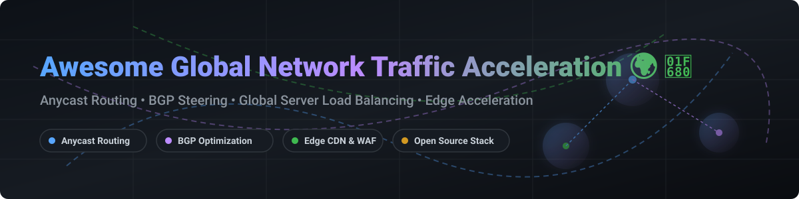

# Awesome-Global-Network-Traffic-Acceleration 🌍 🚀

  

  
  
  
  
  
  

---

## 🌟 Top Global Network Traffic Acceleration Ecosystem 🌐 ⚡

**Curated List of Commercial Traffic Acceleration Platforms & Open-Source Anycast Routing Tools** 🚀  
*Focused on Anycast Routing, Global Server Load Balancing (GSLB), Edge Acceleration, BGP Route Optimization, Multi-CDN Steering, DDoS Mitigation & Self-Hosted Network Infrastructure* 🛠️

**Last updated: October 2026** 📅

---

### 📌 Overview & SEO Summary 🔍

Welcome to the ultimate curated directory of **global network traffic acceleration platforms**, **open-source anycast routing tools**, and **edge acceleration frameworks**. Modern high-concurrency web applications, latency-sensitive API backends, real-time multiplayer gaming servers, and financial trading platforms depend heavily on **low-latency BGP route optimization**, **static anycast IP infrastructure**, and **private global backbone routing** to bypass public internet congestion.

Whether you are seeking enterprise cloud hyperscaler solutions (such as *AWS Global Accelerator*, *Cloudflare Argo Smart Routing*, and *Azure Front Door*), or self-hostable open-source BGP routing daemons (like *FRRouting*, *BIRD*, *GoBGP*, and *ExaBGP*), this guide provides comprehensive insights into market capitalization, starting price models, free tier quotas, and open-source star metrics.

**Key Market Highlights & Performance Benchmarks:** 📊
- ⚡ **AWS Global Accelerator** leverages Amazon’s global private fiber network with **static anycast IPs**, reducing latency by up to **60%** and eliminating first-mile/last-mile packet loss.
- 🌐 **Cloudflare Argo Smart Routing** continuously detects backbone congestion across 300+ edge cities, delivering an **average latency reduction of 30%** and a **27% drop in connection errors**.
- 🔷 **Azure Front Door** integrates **global Anycast L7 HTTP load balancing**, edge WAF protection, and split-TCP optimization with **sub-second regional failover**.
- 🔓 **Open-Source Anycast Networking**: Standard Linux routing stacks powered by **FRRouting (FRR)** and **BIRD** enable custom Anycast DNS and BGP route injection across multi-cloud edge environments.

---

## 📑 Table of Contents 📜

- [🏢 SaaS & Commercial Platforms](#-saas--commercial-platforms)
- [🔓 Open-Source GitHub Projects](#-open-source-github-projects)
- [🛠️ How to Contribute](#%EF%B8%8F-how-to-contribute)
- [📊 Star History](#-star-history)
- [🤝 Support & Sponsorship](#-support--sponsorship)
- [⚠️ Disclaimer](#%EF%B8%8F-disclaimer)

---

## 🏢 SaaS / Commercial Platforms 🌐 💼

**Market Size & Sector Structure Overview:** 📈
The global market for network traffic acceleration, Application Delivery Controllers (ADC), and CDN edge services is estimated at **$28.5 Billion in 2026** (projected to reach **$45+ Billion by 2030** at a CAGR of 13.2%). The market structure is **highly concentrated** (a hyperscaler and tier-1 edge oligopoly dominated by Microsoft, Alphabet, Amazon, Cloudflare, Akamai, and IBM/F5), where network scale, global POP footprint, and private fiber backbones create steep moats and high switching costs.

*Platforms below are sorted by Company Size / Market Capitalization (Descending).* 🏆

| SaaS / Commercial Platform | Company / Owner | Market Size / Valuation | Standard Edition Starting Price | Free Tier / Free Trial Limits | Description |
| :--- | :--- | :--- | :--- | :--- | :--- |
| **[Azure Front Door](https://azure.microsoft.com/en-us/products/frontdoor/)** 🔷 | Microsoft | ~$3.90 Trillion | **$35.00/month base** + **$0.0093/GB** | 30-day free trial ($200 Azure credits applicable during trial) | **Azure-native edge acceleration** — **Global HTTP load balancing, CDN, and WAF** . **Anycast edge acceleration** with **sub-second failover** . **URL-based routing and SSL offload** . ⚡ |
| **[AWS Global Accelerator](https://aws.amazon.com/global-accelerator/)** ☁️ | Amazon | ~$2.0 Trillion | **$0.025/hour per accelerator** + **$0.015/GB** | No permanent free tier (pay-as-you-go from creation) | **AWS-native traffic acceleration** — **Static anycast IP addresses** that route traffic over **AWS global network** . **Up to 60% lower latency** and **reduced jitter** compared to public internet . **Instant regional failover** with health checks . **Supports TCP, UDP, and HTTP/HTTPS** . 🚀 |
| **[Google Cloud Anycast EIP](https://cloud.google.com/vpc/docs/using-anycast)** 🌐 | Google (Alphabet) | ~$2.0 Trillion | **$0.005/hour per IP** ($0.01/hr unused) + **$0.12/GB egress** | 90-day free trial (**$300 free credits** for new accounts) | **GCP-native anycast IPs** — **Global anycast IP addresses** for **global load balancing** . **Traffic routed over Google's private network** . **Sub-second failover with health checks** . 🧭 |
| **[NS1 Global Anycast](https://ns1.com/)** 🟢 | IBM (NS1) | ~$200 Billion (IBM) | **$99.00/month** (Essentials, up to 30M queries) | **30-day free trial** (50M queries, 500 records) & free Developer account | **Global anycast DNS with traffic steering** — **Advanced filter chains and health checks** . **Pulsar for RUM-based multi-CDN steering** . **Dedicated DNS for custom nameservers** . 📡 |
| **[Cloudflare Argo Smart Routing](https://www.cloudflare.com/products/argo-smart-routing/)** 🟠 | Cloudflare Inc. | ~$30 Billion | **$5.00/month base** + **$0.10/GB** (after 1st GB) | No free tier (includes 1st GB/month with $5 base subscription) | **Cloudflare's private backbone routing** — **Routes traffic through Cloudflare's global network** avoiding internet congestion . **Average latency reduction of 30%** . **Real-time route optimization** . **Works with all Cloudflare plans** . 🔥 |
| **[Akamai Edge DNS](https://www.akamai.com/)** 🔴 | Akamai Technologies | ~$15 Billion | Flat per-zone custom contract (approx. **$150/month base**) | Free trial available upon sales request & approval | **Global anycast DNS** — **4,100+ edge locations** in **135+ countries** . **DDoS mitigation and traffic steering** . **The most mature anycast network** . 🛡️ |
| **[F5 Distributed Cloud Mesh](https://www.f5.com/cloud)** 🔵 | F5 Networks | ~$10 Billion | Custom enterprise subscription (Flex Consumption Program) | **45-day free trial** with full enterprise features | **Multi-cloud traffic acceleration** — **Global mesh for traffic steering** . **Anycast and BGP-based routing** . **Integrated WAF, DDoS, and bot defense** . 🕸️ |
| **[Imperva Content Delivery](https://www.imperva.com/)** 🛡️ | Imperva (Thales) | ~$3 Billion | Custom enterprise contract (per bandwidth/traffic volume) | **30-day free trial** (bandwidth capped at **100 Mbps**) | **Security-first CDN and acceleration** — **DDoS mitigation, WAF, and bot protection** . **Global anycast network** with **edge caching** . 🔒 |
| **[Fastly Anycast](https://www.fastly.com/)** 🟣 | Fastly Inc. | ~$1 Billion | **$50.00/month minimum usage** ($0.12/GB North America) | Free developer account with **$50 non-expiring trial credit** | **Edge cloud with anycast routing** — **Instant purge (<150ms globally)** . **VCL customization and Compute@Edge** . **Real-time traffic routing** . ⚡ |
| **[StackPath Edge Delivery](https://www.stackpath.com/)** 📦 | StackPath | Defunct / Service Closed | Defunct (service shut down June 2024) | Service shut down June 2024 (no active trial) | **Edge computing and delivery** — **CDN, WAF, and edge compute** . Service officially sunsetted in 2024 . 🛑 |

---

## 🔓 Open-Source GitHub Projects 🛠️ 💻

*Sorted by GitHub_Stars_Count (Descending)* 🌟

- **[Open vSwitch](https://github.com/openvswitch/ovs)**   
  **Production quality, multilayer virtual switch**, Apache-2.0 licensed. **The standard virtual switch for cloud networking** . **Used by OpenStack, Kubernetes, and major cloud providers** . **The foundation for virtual anycast networking** . 🔀

- **[FRRouting (FRR)](https://github.com/FRRouting/frr)**   
  **The most widely deployed open-source routing stack**, GPL-2.0 licensed. **The de facto standard for open-source BGP** — **used by Cumulus Linux, SONiC, and major cloud providers** . **Supports BGP, OSPF, IS-IS, RIP, EIGRP, and PIM** . **Essential for building anycast routing infrastructure** with **BGP route exchange** . **The foundation of open-source global traffic acceleration** . 🛣️

- **[MetalLB](https://github.com/metallb/metallb)**   
  **Load balancer for bare-metal Kubernetes**, Apache-2.0 licensed. **Provides L4 load balancing via ARP/NDP (L2) or BGP** . **Anycast-based service exposure** . **The standard for bare-metal Kubernetes anycast** . 🛠️

- **[SONiC](https://github.com/sonic-net/SONiC)**   
  **Open-source network operating system for cloud and enterprise**, Apache-2.0 licensed. **The most widely deployed open-source NOS** — **used by Microsoft, Alibaba, and major cloud providers** . **FRRouting-based routing stack** with **BGP for anycast** . **The foundation for cost-effective anycast hardware** . 🌐

- **[kube-vip](https://github.com/kube-vip/kube-vip)**   
  **Virtual IP and load balancer for Kubernetes**, Apache-2.0 licensed. **Provides L2 and BGP-based VIP management** for control plane and services . **Anycast VIP for Kubernetes clusters** . **The standard for Kubernetes anycast VIP** . ☸️

- **[GoBGP](https://github.com/osrg/gobgp)**   
  **BGP implementation in Go**, Apache-2.0 licensed. **Modern, high-performance BGP** . **API-first design** for automation . **Used for anycast route exchange in cloud environments** . **The most developer-friendly BGP implementation** . 🚀

- **[Batfish](https://github.com/batfish/batfish)**   
  **Network configuration analysis and validation**, Apache-2.0 licensed. **Analyzes network configurations for correctness** . **Validates BGP routing policies** . **The standard for anycast network configuration testing** . 🐟

- **[BIRD](https://github.com/BIRD/bird)**   
  **The BIRD Internet Routing Daemon**, GPL-2.0 licensed. **The most widely used open-source BGP daemon** — **used by network operators worldwide** . **Lightweight and efficient** . **Supports BGP, OSPF, RIP, and Babel** . **The standard for anycast BGP route exchange** . 🐦

- **[ExaBGP](https://github.com/ExaNetworks/exabgp)**   
  **The BGP engine for software-defined networking**, BSD-3-Clause licensed. **Allows applications to speak BGP directly** . **Ideal for Anycast route control, health checking, and DDoS Flowspec steering** . 💥

- **[VyOS](https://github.com/vyos/vyos-build)**   
  **Open-source network operating system with advanced routing**, GPL-2.0 licensed. **BGP and OSPF routing protocols** . **VPN, firewall, and high availability** support . **Cost efficiency** — no licensing fees . **The most complete open-source routing platform for anycast** . ⚙️

- **[RIPE Atlas](https://github.com/RIPE-NCC/ripe-atlas)**   
  **Global network measurement platform**, open-source. **10,000+ probes worldwide** for **latency, routing, and anycast measurement** . **The standard for global network performance measurement** . 📡

- **[Terraform Provider for Equinix](https://github.com/equinix/terraform-provider-equinix)**   
  **Terraform provider for Equinix**, MPL-2.0 licensed. **Infrastructure-as-code for Equinix Fabric** . **Automate anycast virtual connections** . **The standard for automating Equinix interconnects** . 🔗

- **[Terraform Provider for Megaport](https://github.com/megaport/terraform-provider-megaport)**   
  **Terraform provider for Megaport**, MPL-2.0 licensed. **Infrastructure-as-code for interconnect provisioning** . **Automate anycast traffic steering** . **The standard for automating software-defined interconnects** . 🔧

---

## 🛠️ How to Contribute 🤝

Contributions are welcome! Follow these steps to submit new traffic acceleration platforms or open-source anycast routing software:

1. 🍴 **Fork** the repository.
2. 📝 **Add/edit** entries in `README.md` maintaining table/list structure and formatting.
3. 🔗 Include project title, official website/GitHub link, exact Stars_Count, license, and brief description.
4. 🚀 Submit a **Pull Request** with a descriptive summary of your changes.

---

## 📊 Star History 📈

---

## 🤝 Support & Sponsorship ☕ 💖

Thank you for exploring and utilizing this global network traffic acceleration resource! If you find this directory valuable for your cloud architecture, networking projects, or research, please consider supporting the project:

- ⭐ **Star** this repository to increase visibility and help other network engineers discover it!
- 🔀 **Fork** and share it with your engineering team, DevOps groups, and technical communities.
- ☕ **Buy Me a Coffee & Sponsor**: Support ongoing curation, open-source research, and maintenance via the [GitHub Sponsor Dashboard](https://github.com/sponsors/ishandutta2007).

---

## ⚠️ Disclaimer ℹ️

- This is a **community-curated** directory — not exhaustive and not an endorsement. ℹ️
- **AWS Global Accelerator provides static anycast IPs** and routes traffic over **AWS global network** — **up to 60% lower latency** . **Cloudflare Argo routes through Cloudflare's private backbone** — **average latency reduction of 30%** . **Azure Front Door provides anycast edge acceleration with sub-second failover** .
- **Pricing varies by platform**: **AWS Global Accelerator at $0.025/hour per accelerator + $0.015/GB** , **Cloudflare Argo at $0.10/GB** , **Azure Front Door at $35/month base + $0.0093/GB** .
- **Open-source anycast routing tools (FRR, BIRD, GoBGP, ExaBGP) are not turnkey** — they require **network engineering expertise, BGP peering, and anycast infrastructure** . **Always validate route convergence and failover with a proof-of-concept** before production deployment . 🌍

---

  <b>Made with ❤️ for network engineers, cloud architects, and open-source traffic acceleration advocates.</b>

